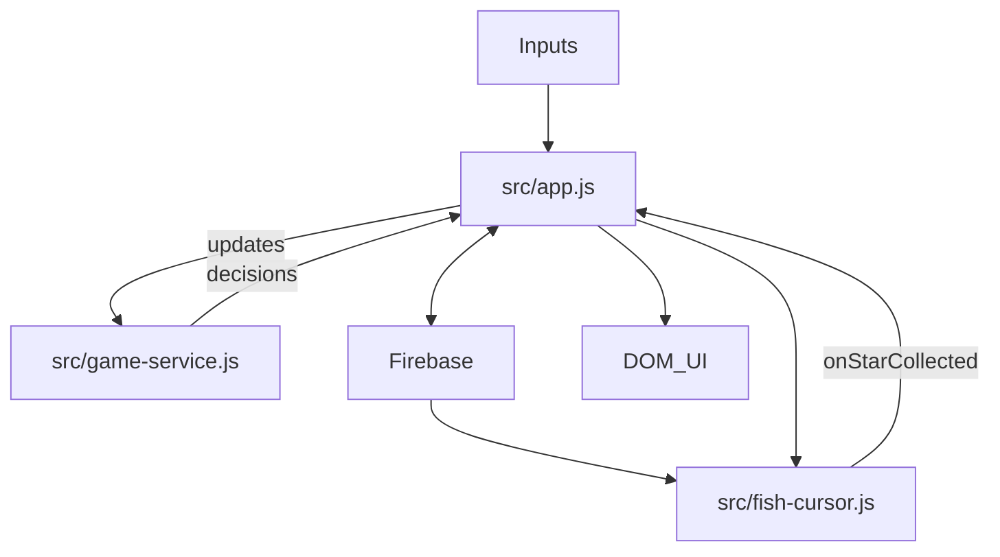

# squidly-fish-game
A cause effect fish games for Squidly platform

## System Doc

### Architecture Overview
The game is a controller-renderer system with Firebase-backed shared state.
`src/app.js` owns state orchestration and UI, `src/game-service.js` contains
pure game rules, and `src/fish-cursor.js` renders and simulates the 3D fish
scene.

Key roles:
- `src/app.js`: State authority, Firebase sync, UI creation, and cursor lifecycle.
- `src/game-service.js`: Pure logic for stars, score, grid size, and mode changes.
- `src/fish-cursor.js`: WebGL renderer, animation loop, collision detection.
- `src/input-manager.js`: Pointer tracking for host/participant inputs.
- `squidly-apps-api.js`: Platform glue for Firebase + sidebar icons.
- `src/fish-cursor-config.js`: Built-in fallback visual tuning defaults.
- `config/*.json`: Runtime tunables loaded during app startup.

### Initialization Flow (Runtime Boot)
1. Host-only defaults: `src/app.js` sets initial Firebase keys if missing
   (`gridSize`, `score`, `gameMode`). `gameMode` is derived from participant
   presence automatically. Participants do not write.
2. Cursor setup: `window.fishGame.init()` creates `WebGLFishCursor`
   and connects the `onStarCollected` callback.
3. Input wiring:
   - Local mouse events update the active pointer (host or participant ID).
   - Squidly `addCursorListener` events update pointers from eye/mouse tracking.
4. Firebase subscriptions attach for:
   - `gridSize`, `score`, `gameMode`, `stars`.
5. UI creation:
   - Grid progress HUD is injected into the DOM.
   - Multiplayer grid UI is created if the mode requires it.

### Firebase Data Model
All shared data is under `fish-game/`:
- `gridSize`: star grid size (1-4). Drives both UI grid and star placement.
- `score`: shared score, incremented on collection.
- `gameMode`: `single-player` or `multiplayer`, automatically updated by the
  host based on whether a participant is active.
- `stars`: array of `{ id, row, col }` entries.

### Game Mode Rules (Detailed)
Game mode is detected automatically:
- No active participant: `single-player`.
- Active participant present: `multiplayer`.
- If the participant leaves, the host switches back to `single-player`.

Single-player:
- Host controls the fish.
- Stars are auto-generated by the host when the game starts or stars are empty.
- Collision authority belongs to the controlling pointer (host in practice).

Multiplayer:
- Participant controls the fish.
- The current star-setting player uses the clickable grid UI to stage star
  choices.
- Staged stars do not appear in the play field immediately. After choosing the
  desired grid cells, the star-setting player presses the `Set Stars` button.
- Pressing `Set Stars` publishes the staged selections to Firebase, making those
  stars appear on the screen for the participant to collect.
- The total number of visible stars from that `Set Stars` batch is the
  requirement for earning one grid progress star: all visible stars must be
  collected before grid progress increases.
- Collision authority is granted only to the participant client when controlling.

Collision authority is critical: only the controlling client is allowed to
report collisions to `src/app.js`, which prevents score double-counting.

### State and Data Flow
`src/app.js` is the central controller and is the only module that writes to
Firebase in response to gameplay. `src/fish-cursor.js` never writes to Firebase;
it only reports collisions through a callback.

### Star Lifecycle (Step-by-Step)
1. Star generation / placement:
   - In single-player, the host calls
     `GameService.generateRandomStars(gridSize)` and writes the result to
     Firebase.
   - In multiplayer, the star-setting player clicks grid cells to stage a star
     layout first, then presses `Set Stars` to write the staged stars to
     Firebase.
2. Star sync:
   - `src/app.js` receives Firebase star changes and updates `firebaseStars`.
   - `src/app.js` calls `currentCursor.syncStarsFromFirebase(...)`.
3. Star animation:
   - `src/fish-cursor.js` animates stars with a float + spin effect each frame.
4. Collision:
   - Collision is a distance check between fish and star positions.
   - Only the controlling client calls `onStarCollected`.
5. Score update and removal:
   - `src/app.js` calls `GameService.collectStar`, updates `score`,
     and writes `score` + updated `stars` to Firebase.
6. Regeneration:
   - In single-player, host auto-regenerates when `stars` becomes empty.

### Input Arbitration (Who Controls the Fish)
Input data lands in `InputManager` under pointer IDs: `host` and `participant`.
`src/fish-cursor.js` decides who controls the fish each frame:
- Multiplayer: only participant pointer can move the fish.
- Single-player: participant pointer takes priority, host is fallback.

The controlling client also gains collision authority for that frame, ensuring
only one client emits `onStarCollected`.

### Rendering and Simulation Loop
The WebGL loop in `src/fish-cursor.js` runs every animation frame:
1. Compute delta time.
2. Select active pointer (host/participant) based on mode rules.
3. Set collision authority flag (`_isControllingFish`).
4. Update fish target position via raycast to a plane.
5. Animate fish body, fins, eyes, and color based on speed.
6. Update background particles.
7. Update stars (float, spin, twinkle) and detect collisions.
8. Render the scene.

### UI Elements and Controls
- Grid progress HUD: A fixed overlay created in `src/game-ui.js`.
- Star control grid: A host-only grid for staging star placement in multiplayer
  mode. Clicking grid cells updates the staged selection only.
  Styles live in `styles/style.css` under `.star-control-grid` and `.star-control-cell`.
- `Set Stars` sidebar control: shown in multiplayer mode to the player setting
  stars. It commits the staged grid selection to Firebase so the stars appear on
  the play field.
- Sidebar controls (Squidly UI): grid progression, role swapping, and staged
  star commit via `setIcon`, writing through Firebase for sync. The manual mode
  toggle is not needed because mode is detected from participant presence.

### Configuration and Constants
Runtime config is loaded from `config/`:
- `config/app.json`: audio paths, volume scale, unlock events, initial app state.
- `config/game-rules.json`: grid bounds, layout-clear rules, retry delays.
- `config/game-ui.json`: UI defaults.
- `config/fish-cursor.json`: fish appearance, animation, particles, stars, input timeout.

### Optional Modules
- `sound-engine.js` provides audio engines but is not currently wired into the
  fish game loop.
